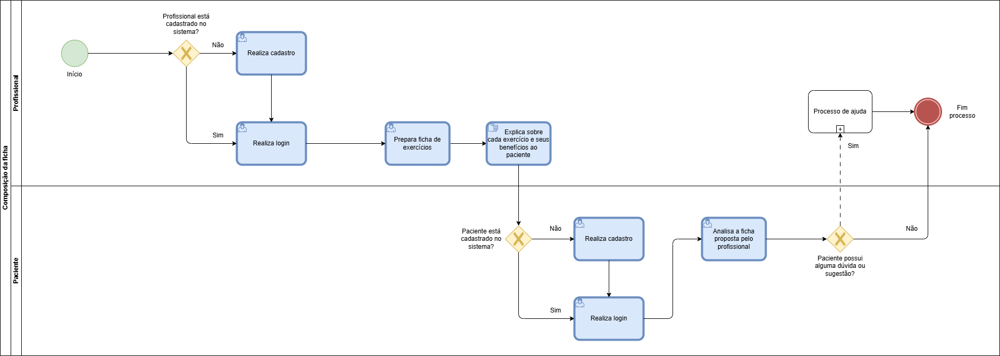

### 3.3.1 Processo 1 – Composição da Ficha

Processo destinado a comunicação entre o paciente e o profissional fisioterapeuta, para criação da ficha de exercícios. Com detalhamento de cada exercício, análise do paciente, e feedback do usuário ao profissional.

#### Características:

* Montagem da ficha de exercício pelo profissional: O primeiro passo envolve o profissional de saúde ou preparador físico criar uma ficha de exercícios personalizada para o cliente. Isso geralmente é feito com base nas metas do cliente, suas necessidades físicas, histórico médico, nível de condicionamento atual e qualquer limitação física ou lesão existente.
* Explicação dos exercícios: O profissional então explica detalhadamente cada exercício incluído na ficha, destacando os benefícios específicos de cada um e como eles contribuem para os objetivos do cliente.
* Retroalimentação do paciente: Uma vez que a ficha de exercícios é apresentada ao paciente, este tem a oportunidade de analisá-la. É importante que o paciente se sinta confortável com os exercícios propostos e seja capaz de realizá-los dentro de suas capacidades físicas e limitações. Portanto, o paciente pode fornecer feedback ao profissional, discutindo quaisquer preocupações ou dúvidas que tenha em relação aos exercícios propostos.

#### Oportunidades de Melhoria:
- Maior clareza na explicação do motivo de cada exercício selecionado para o paciente.
- Estabelecer um sistema para priorizar exercícios de acordo com as necessidades específicas do paciente.
- Melhorar a comunicação para garantir que o paciente compreenda completamente a lista de exercícios e suas razões.

#### Modelo BPMN do Processo 1:

#### Detalhamento das Atividades:

---
**Atividade 1: Realiza login / Página de login**

| **Campo**          | **Tipo**              | **Restrições**               | **Valor default** |
| ------------------ | --------------------- | ---------------------------- | ----------------- |
| Tipo usuário       | Seleção               | Obrigatório / profissional ou paciente |         |
| E-mail             | Texto                 | E-mail                       |                   |
| Senha              | Texto                 | Obrigatório                  |                   |

| **Comandos**                   | **Destino**                            | **Tipo**        |
| ------------------------------ | -------------------------------------- | --------------- |
| Login                          | Página inicial da aplicação            | Default         |
| Esqueceu Login/Senha?          | Página de recuperação de senha         | Default         |
| Fazer o cadastro               | Página de registro de novo usuário     | Default         |

---
**Atividade 2: Realiza cadastro / Página de cadastro do profissional**

| **Campo**          | **Tipo**              | **Restrições**              | **Valor default** |
| ------------------ | --------------------- | --------------------------- | ----------------- |
| Nome               | Texto                 | Somente letras, obrigatório |                   |
| Registro profissional| Texto               | Obrigatório                 |                   |
| CPF                | Texto                 | Somente números, 15 dígitos, obrigatório |      |
| Email              | Texto                 | Obrigatório                 |                   |
| N° de telefone     | Texto                 | Somente números, 11 dígitos, obrigatório |      |
| Senha              | Texto                 | Obrigatório                 |                   |
| Tipo Usuário       | Seleção               | Obrigatório                 |                   |

| **Comandos** | **Destino**                                                          | **Tipo**  |
| ------------ | -------------------------------------------------------------------- | --------- |
| Registrar    | Realização do cadastro do profissional                               | Default   |
| Fazer Login  | Página de login da aplicação                                         | Default   |

---
**Atividade 3:  Realiza cadastro do paciente / página de cadastro do paciente**

| **Campo**          | **Tipo**              | **Restrições**              | **Valor default** |
| ------------------ | --------------------- | --------------------------- | ----------------- |
| Nome               | Texto                 | Somente letras, obrigatório |                   |
| CPF                | Texto                 | Somente números, 15 dígitos, obrigatório |      |
| Email              | Texto                 | Obrigatório                 |                   |
| N° de telefone     | Texto                 | Somente números, 11 dígitos, obrigatório |      |
| Senha              | Texto                 | Obrigatório                 |                   |
| CEP                | Texto                 | Somente números, 8 dígitos, obrigatório |       |
| Número da casa/apt complemento | Texto     | Obrigatório                 |                   |
| Descrição do paciente | Área de texto      | Obrigatório                 |                   |
| Tipo usuário          | Seleção            | Obrigatório                 |                   |

| **Comandos** | **Destino**                                                          | **Tipo**  |
| ------------ | -------------------------------------------------------------------- | --------- |
| Registrar    | Realização do cadastro do profissional                               | Default   |
| Fazer Login  | Página de login da aplicação                                         | Default   |

---
**Atividade 4: Prepara ficha de exercícios.**

| **Campo**              | **Tipo**          | **Restrições**        | **Valor default**  |
| ---------------------- | ----------------- | --------------------- | ------------------ |
| Nome do paciente       | Área de texto     | Obrigatório           |                    |
| CPF do paciente        | Texto             | Somente números, 15 dígitos, obrigatório | |
| Exercício              | Área de texto     | Obrigatório           |                    |
| Descrição              | Área de texto     | Obrigatório           |                    |
| Data de início         | Data              | Obrigatório           |                    |
| Data de término        | Data              | Obrigatório           |                    |

| **Comandos**          | **Destino**                              | **Tipo** |
| --------------------- | ---------------------------------------- | -------- |
| Adicionar um exercício | Adicionar um exercício na ficha         | Default  |
| Informações da ficha  | Adicionar informações sobre a ficha      | Default  |
| Exercícios            | Adicionar exercício na ficha             | Default  |
| Finalizar             | Salva ficha de exercícios do paciente    | Default  |

---
**Atividade 5: Analisa a ficha proposta pelo profissional**

| **Campo**                    | **Tipo**          | **Restrições**          | **Valor default**  |
| ---------------------------- | ----------------- | ----------------------- | ------------------ |
| Descrição                    | Área de texto     | Não editável            |                    |
| Nome exercício               | Área de texto     | Não editável            |                    |
| Avaliação                    | Icone             | Não editável            |                    |

| **Comandos**               | **Destino**                                                | **Tipo**  |
| -------------------------- | ---------------------------------------------------------- | --------- |
| Sair                       | Página inicial da aplicação                                | Default   |
| Avaliar                    | Página de avaliação                                        | Default   |