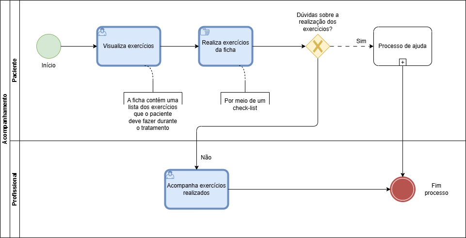

### 3.3.2 Processo 2 – Acompanhamento de Exercícios

Processo destinado para o acompanhamento profissional dos exercícios pré-estabelecidos para o paciente, com acompanhamento contínuo do progresso do paciente, como atividades realizadas, pendências e eventuais feedbacks realizados pelo paciente.

#### Características:

* Implementação da ficha de exercícios pelo paciente: Após receber a ficha de exercícios do fisioterapeuta, o paciente é responsável por seguir o programa de exercícios conforme orientado.
* Monitoramento pelo fisioterapeuta: Durante o período em que o paciente está seguindo a ficha de exercícios, o fisioterapeuta pode acompanhar o progresso do paciente. Para isso, o paciente irá registrar os exercícios realizados, assim como frequência das atividades, e as dificuldades encontradas.

#### Oportunidades de melhoria:

O processo de acompanhamento de exercícios é fundamental para garantir que o paciente siga corretamente as orientações e realize as atividades prescritas. Abaixo estão algumas oportunidades de melhoria para este processo:

- Implementação de um sistema de notificação automática para lembrar os pacientes de realizar suas atividades.
- Introdução de um mecanismo de monitoramento remoto para que os fisioterapeutas possam acompanhar o progresso do paciente mesmo à distância.
- Criação de um sistema de incentivos para motivar os pacientes a seguirem regularmente suas fichas de exercícios.

#### Modelo BPMN do Processo 2

#### Detalhamento das atividades
---
**Atividade 1: Visualiza exercícios**

| **Campo**                    | **Tipo**          | **Restrições**          | **Valor default**  |
| ---------------------------- | ----------------- | ----------------------- | ------------------ |
| Descrição                    | Área de texto     | Não editável            |                    |
| Nome exercício               | Área de texto     | Não editável            |                    |
| Avaliação                    | Icone             | Não editável            |                    |

| **Comandos**               | **Destino**                                                | **Tipo**  |
| -------------------------- | ---------------------------------------------------------- | --------- |
| Sair           | Página inicial da aplicação                                            | Default   |
| Avaliar        | Página de avaliação                                                    | Default   |

---
**Atividade 2: Avalia o exercício**

| **Campo**                   | **Tipo**              | **Restrições**             | **Valor default** |
| --------------------------- | --------------------- | -------------------------- | ----------------- |
| Exercício                   | Texto                 | Não editável               |                   |
| Consegui fazer o exercício? | Seleção               |                            |                   |
| O que achou do exercício?   | Seleção               |                            |                   |

| **Comandos** | **Destino**                                                  | **Tipo**  |
| ------------ | ------------------------------------------------------------ | --------- |
| Finalizar    | Salvar avaliação no sistema                                  | Default   |
| Voltar       | Página da ficha                                              | Default   |

**Atividade 3: Acompanha exercícios realizados**

| **Campo**                    | **Tipo**          | **Restrições**          | **Valor default**  |
| ---------------------------- | ----------------- | ----------------------- | ------------------ |
| CPF do paciente              | Área de texto     | Obrigatório para visualização |              |
| Descrição                    | Área de texto     | Não editável            |                    |
| Nome exercício               | Área de texto     | Não editável            |                    |
| Avaliação                    | Icone             | Não editável            |                    |

| **Comandos**               | **Destino**                                                | **Tipo**  |
| -------------------------- | ---------------------------------------------------------- | --------- |
| Sair                       | Página inicial da aplicação                                | Default   |
| Pesquisar                  | Exibe a ficha do paciente                                  | Default   |