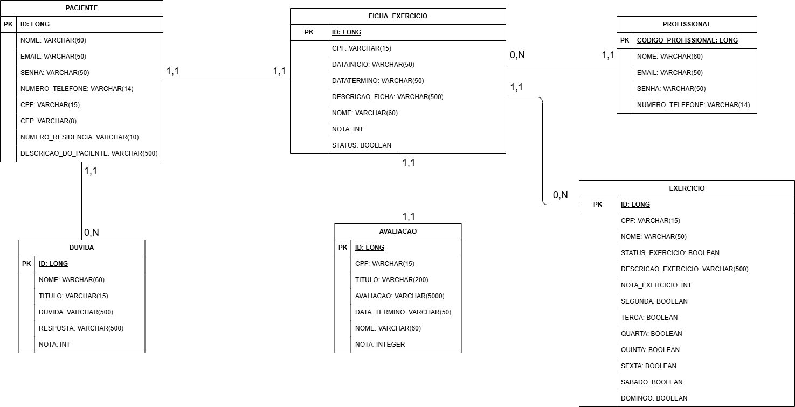

## 4. Projeto da solução

### 4.1. Modelo de dados

---

### 4.2. Tecnologias

| **Dimensão**   | **Tecnologia**  |
| ---            | ---             |
| SGBD           | MySQL           |
| Front end      | HTML+CSS+JS     |
| Back end       | Java Spring Boot|
| Deploy         | GitHub Pages    |

#### Observações:
- SGBD: MySQL - um sistema de gerenciamento de banco de dados relacional amplamente utilizado para armazenar e manipular dados.
- Front end: HTML+CSS+JS - para a interface do usuário, utilizando HTML para estruturação, CSS para estilização e JavaScript para interatividade.
- Back end: Java Spring Boot - um framework em Java para criação de aplicativos web, fornecendo um ambiente simplificado para o desenvolvimento de serviços RESTful e outras aplicações.
- Deploy: GitHub Pages - uma plataforma de hospedagem de sites estáticos oferecida pelo GitHub, permitindo a implantação direta de páginas HTML, CSS e JavaScript a partir de um repositório do GitHub.
- Para desenvolvimento, as ferramentas e ambientes de desenvolvimento integrado (IDEs) podem incluir o Eclipse ou IntelliJ IDEA para desenvolvimento Java, editores de texto como Visual Studio Code para HTML, CSS e JavaScript.
